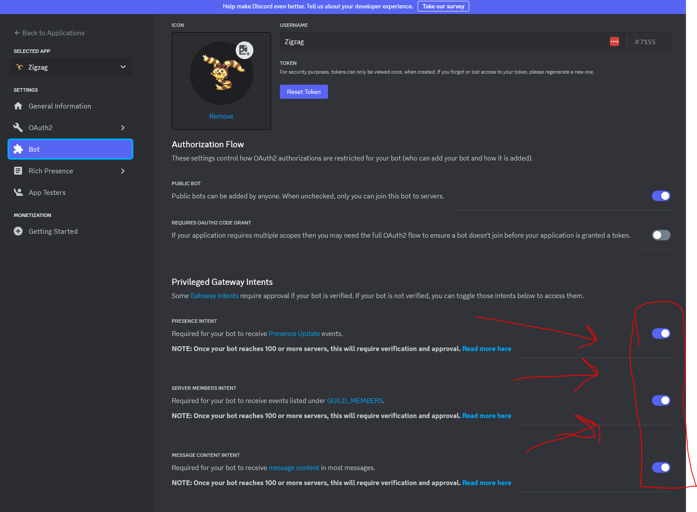

# spritebot
SpriteBot

Words words words 
I'll write better things here later B)

## Setup
This project uses [poetry](https://python-poetry.org/docs/) to handle dependencies

Make sure you have python installed. Then, in a terminal window, run:

`pip install poetry`

Then install the dependencies with poetry:

`poetry install`

Next make a file at the root of this project called `.env` file to store the bot secret in (instructions on how to set up a bot and get the bot secret [here](https://discordpy.readthedocs.io/en/stable/discord.html)). The contents of the file should look like this:

`BOT_SECRET=SECRET-GOES-HERE`

Also, make sure that the intents are enabled on the bot (or else it will be grumpy and die when it tries to run):

## Running

Run the following command in terminal:

`poetry run zigzag.py`